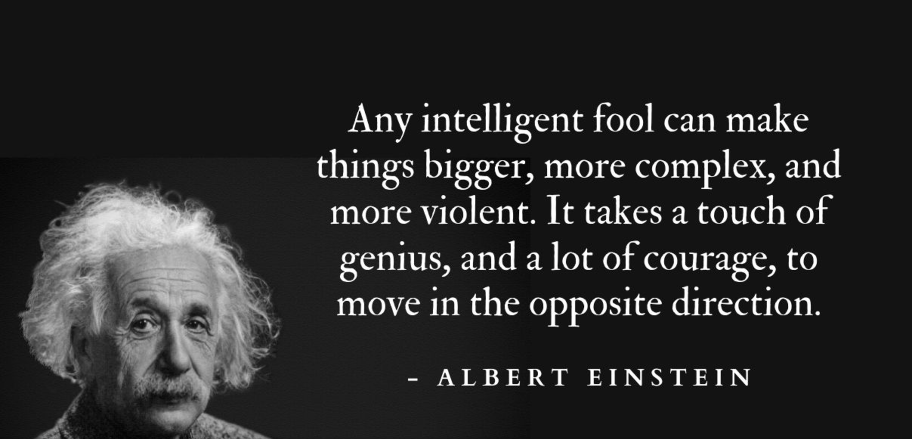

# The Ultimate Overengineered Question Generator 2.0

**"Because simple code is for the weak"**

Welcome to **The Ultimate Overengineered Question Generator 2.0**! This Python application is meticulously crafted to generate questions with maximum engineering complexity while maintaining actual functionality. It's designed to mock and amuse fans of overly complicated review appraisals, especially those laden with redundant references to accuracy and unnecessary abstraction. Dive into a world where every line of code serves no practical purpose other than to showcase the art of overengineering.

---

## Table of Contents

- [Features](#features)
- [Installation](#installation)
- [Configuration](#configuration)
- [Usage](#usage)
  - [Basic Usage](#basic-usage)
  - [Advanced Usage](#advanced-usage)
- [Examples](#examples)
- [Humorous Elements](#humorous-elements)
- [Metrics and Logging](#metrics-and-logging)
- [Contributing](#contributing)
- [License](#license)

---

## Features

- **Multiple Complexity Levels:** From simple direct questions to recursive paradoxes.
- **Philosophical and Existential Depth:** Adds layers of unnecessary depth for comedic effect.
- **Asynchronous Operations:** Ensures questions are generated with maximum delay for dramatic effect.
- **Caching Mechanism:** Implements intricate caching strategies to manage question "entropy."
- **State Management:** Tracks the lifecycle of question generation with rollback capabilities.
- **Metrics Collection:** Gathers humorous metrics like "overthinking score" and "existential weight."
- **Customizable ASCII Art:** Personalize the look and feel with customizable headers and footers.
- **Feature Flags:** Toggle absurd features like excessive punctuation and reverse text.
- **Observer Pattern:** Logs every generated question for added complexity.

---

## Installation

1. **Clone the Repository:**

   ```bash
   git clone https://github.com/angelos-d-l/Overengineered-Question-Genetator.git
   cd Overengineered-Question-Genetator
   ```

2. **Create a Virtual Environment (Optional but Recommended):**

   ```bash
   python -m venv venv
   source venv/bin/activate  # On Windows: venv\Scripts\activate
   ```

3. **Install Dependencies:**

   Ensure you have `pip` installed. Then, install the required packages:

   ```bash
   pip install -r requirements.txt
   ```

   *If you don't have a `requirements.txt`, install `PyYAML` directly:*

   ```bash
   pip install PyYAML
   ```

---

## Configuration

The application uses a `config.yaml` file to manage various settings, enhancing both functionality and humor. Here's how to set it up:

1. **Create `config.yaml`:**

   Place a `config.yaml` file in the same directory as the script or specify its path using the `--config` argument.

2. **Sample `config.yaml`:**

   ```yaml
   ascii_art:
     header: |
       ╔══════════════════════════════════════════════════════════╗
       ║ The Ultimate Overengineered Question Generator 2.0       ║
       ║ "Embrace the redundancy of complexity"                   ║
       ╚══════════════════════════════════════════════════════════╝
     footer: |
       ╔══════════════════════════════════════════════════════════╗
       ║ Remember: Overengineering is an art form                 ║
       ╚══════════════════════════════════════════════════════════╝

   feature_flags:
     enable_excessive_punctuation: true
     enable_philosophical_prefix: true
     enable_reverse_text: false
   ```

3. **Configuration Breakdown:**

   - **AsciiArt:**
     - **header:** Customizes the ASCII art displayed at the start of the application.
     - **footer:** Customizes the ASCII art displayed at the end of the application.

   - **FeatureFlags:**
     - **enable_excessive_punctuation:** When `true`, appends excessive punctuation to questions.
     - **enable_philosophical_prefix:** When `true`, adds a philosophical prefix to questions.
     - **enable_reverse_text:** When `true`, reverses the text of certain questions for added absurdity.

4. **Environment Variable Overrides:**

   You can override any configuration by setting environment variables with the corresponding uppercase keys. For example:

   ```bash
   export ENABLE_EXCESSIVE_PUNCTUATION=true
   ```

---

## Usage

Run the script using Python with various command-line arguments to generate your desired questions.

### Basic Usage

```bash
python the_ultimate_overengineered_question_generator.py
```

This will generate a simple question with default settings.

### Advanced Usage

The script offers a plethora of options to customize the complexity, metrics, state management, and more.

```bash
python the_ultimate_overengineered_question_generator.py [OPTIONS]
```

#### Available Options:

- `--complexity`: Set the question complexity level.
  - Choices: `simple`, `moderate`, `complex`, `recursive`, `philosophical`, `existential_crisis`, `quantum`, `infinite_loop`
  - Default: `simple`

- `--philosophical-depth`: Set the philosophical depth level.
  - Type: Integer
  - Default: `5`

- `--overthinking-coefficient`: Set the overthinking coefficient.
  - Type: Float
  - Default: `1.0`

- `--chain-length`: Generate a chain of questions.
  - Type: Integer
  - Default: `1`

- `--state-management`: Enable state management features.
  - Action: `store_true`

- `--rollback-enabled`: Enable rollback capabilities.
  - Action: `store_true`

- `--metrics`: Display utterly unnecessary metrics.
  - Action: `store_true`

- `--config`: Path to configuration file.
  - Type: String
  - Default: `config.yaml`

- `--max-depth`: Set the maximum depth for recursive questions.
  - Type: Integer
  - Default: `3`

---

## Examples

### 1. Generate a Simple Question

```bash
python the_ultimate_overengineered_question_generator.py --complexity simple
```

**Output:**

```
How much attention to detail do you exhibit to ensure accuracy in your work?
```

### 2. Generate a Recursive Question with Maximum Depth

```bash
python the_ultimate_overengineered_question_generator.py --complexity recursive --max-depth 5
```

**Output:**

```
How meticulousness are you in while focusing on How precision are you in during your pursuit of How accuracy are you in as you implement How attention to detail are you in your quest for comprehend the consequences of your actions?
```

### 3. Generate a Chain of Complex Questions with Metrics

```bash
python the_ultimate_overengineered_question_generator.py --complexity complex --chain-length 3 --metrics
```

**Output:**

```
How exactness are you in demonstrating precision and meticulousness to comprehend the implications of your decisions?
```

---

## Humorous Elements

- **Redundant References to Accuracy:** Questions are loaded with synonyms and redundant phrases related to accuracy, making them hilariously overcomplicated.
  
  *Example:*

  ```
  How much attention to detail and precision do you display to ensure accuracy, reduce errors, and understand the impact of your work?
  ```

- **Philosophical and Existential Overtones:** Adds unnecessary depth and existential queries for comedic effect.
  
  *Example:*

  ```
  In our endless quest for meaning, how meticulousness are you in while focusing on comprehending the consequences of your actions?
  ```

- **Recursive Paradoxical Questions:** Generates questions that recursively call themselves, leading to hilarious, almost infinite loops.
  
  *Example:*

  ```
  How meticulousness are you in while focusing on How precision are you in during your pursuit of How accuracy are you in as you implement How attention to detail are you in your quest for comprehend the consequences of your actions?
  ```

---

## Metrics and Logging

While maintaining a humorous context, the application collects and displays meaningful metrics:

- **Questions Generated:** Tracks the number of questions generated per complexity level.
- **Overthinking Score:** Calculates an "overthinking score" for each question.
- **Detailed Metrics:** Stores additional details for each question, such as entropy levels and generation times.

---

## Contributing

1. **Fork the Repository**
2. **Create a Feature Branch**

   ```bash
   git checkout -b feature/YourFeatureName
   ```

3. **Commit Your Changes**

   ```bash
   git commit -m "Add your feature"
   ```

4. **Push to the Branch**

   ```bash
   git push origin feature/YourFeatureName
   ```

5. **Open a Pull Request**

---

## License

This project is licensed under the [MIT License](LICENSE).

---

**Remember: Overengineering is an art form**


